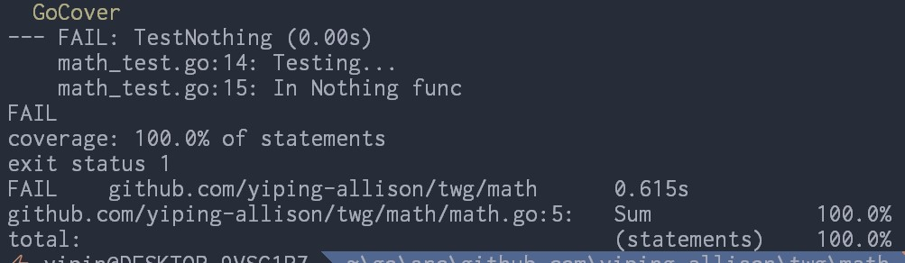

# `GoCover`

## Description

`GoCover` runs the following go command:

* `go test -coverprofile=filename`
* `go tool cover -func=filename`

where _filename_ is a temporary file generated using in-built PowerShell utility.
The temporary file will be removed once both go commands are done executing.

More information about go coverage and its usages can be found on [The Go Blog](https://blog.golang.org/cover).

<p align="center">
	
</p>

## Syntax

`GoCover`

## Example

```powershell
PS> GoCover

PASS
coverage: 100.0% of statements
ok      github.com/yiping-allison/twg/golden    0.762s
github.com/yiping-allison/twg/golden/gradient.go:8:     fib             100.0%
github.com/yiping-allison/twg/golden/gradient.go:25:    FibGradient     100.0%
total:                                                  (statements)    100.0%
```
