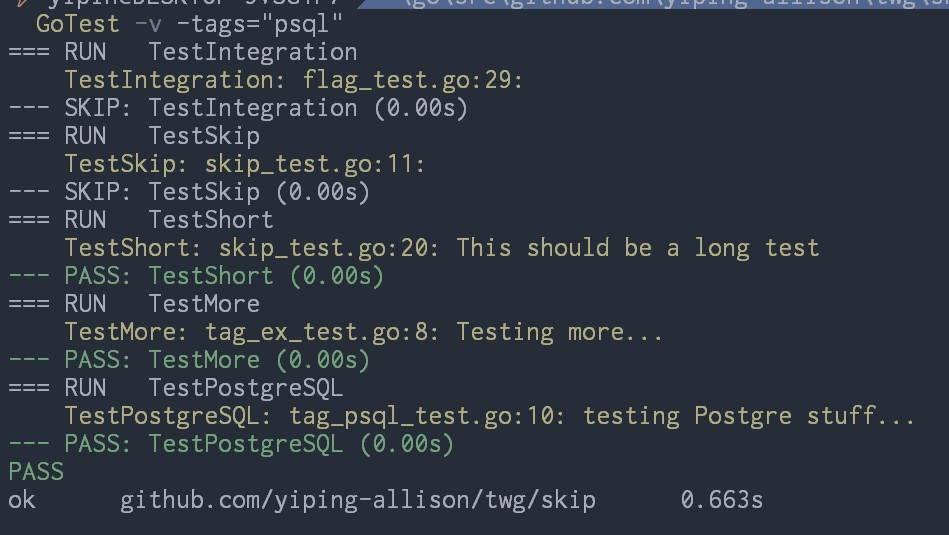
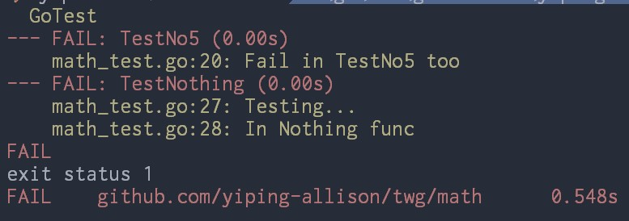

# `GoTest`

## Description

`GoTest` runs the command `go test` and prints the result with the following
color codes:

* Green - PASS
* Red - FAIL
* Yellow - Go log messages

This is an implementation of Jon Calhoun's `go_test()` command:

```shell
go_test() {
    go test $* | sed ''/PASS/s//$(printf "\033[32mPASS\033[0m")/'' | 
    sed ''/FAIL/s//$(printf "\033[31mFAIL\033[0m")/'' | 
    sed ''/FAIL/s//$(printf "\033[31mFAIL\033[0m")/'' | 
    GREP_COLOR="01;33" egrep --color=always '\s*[a-zA-Z0-9\-_.]+[:][0-9]+[:]|^'
}
```

<p align="center">
	
</p>

<p align="center">
	
</p>

## Syntax

1. `GoTest`
2. `GoTest -v`
3. `GoTest -run TestName -v`
4. `GoTest -v -tags="unit"`

## Example

```powershell
PS> GoTest -run TestFibGradient -v

=== RUN   TestFibGradient
--- PASS: TestFibGradient (0.15s)
PASS
ok      github.com/yiping-allison/twg/golden    0.722s
```
